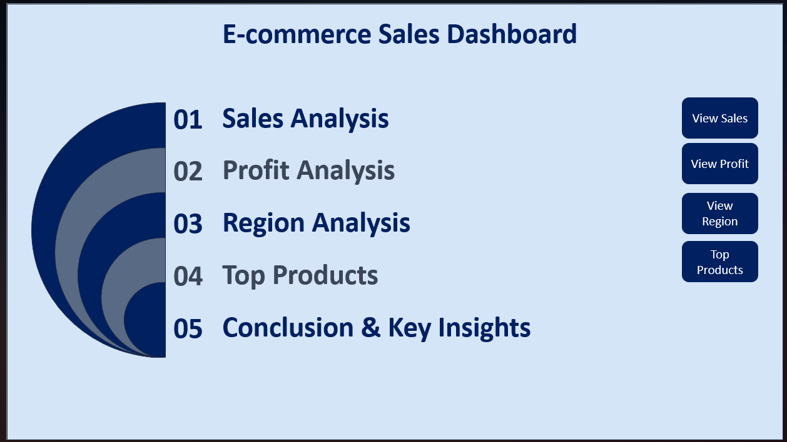
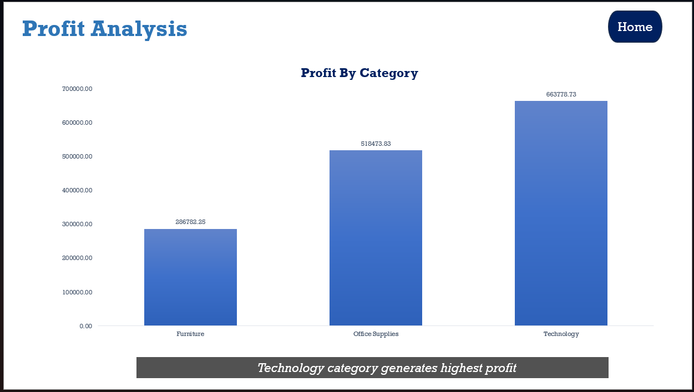
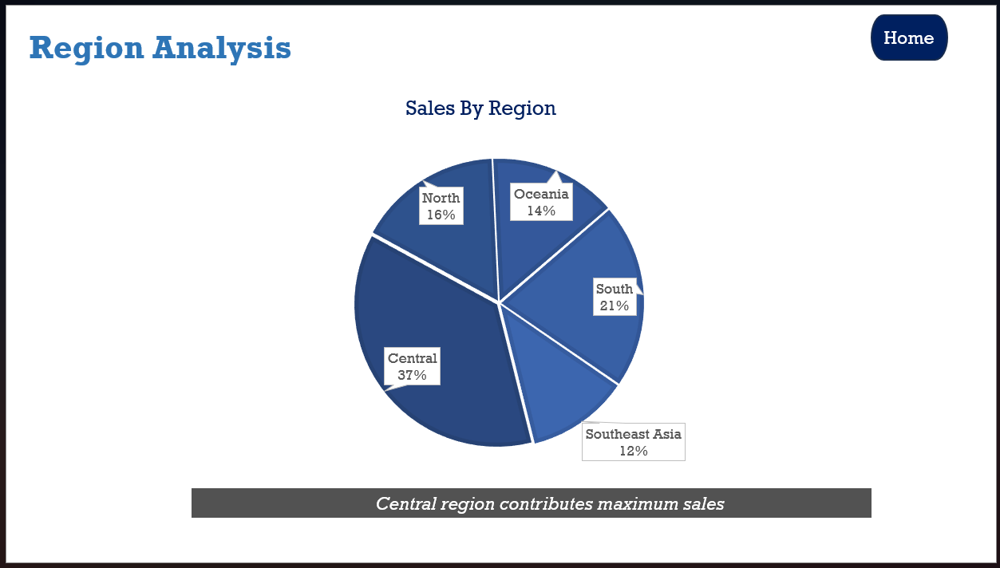
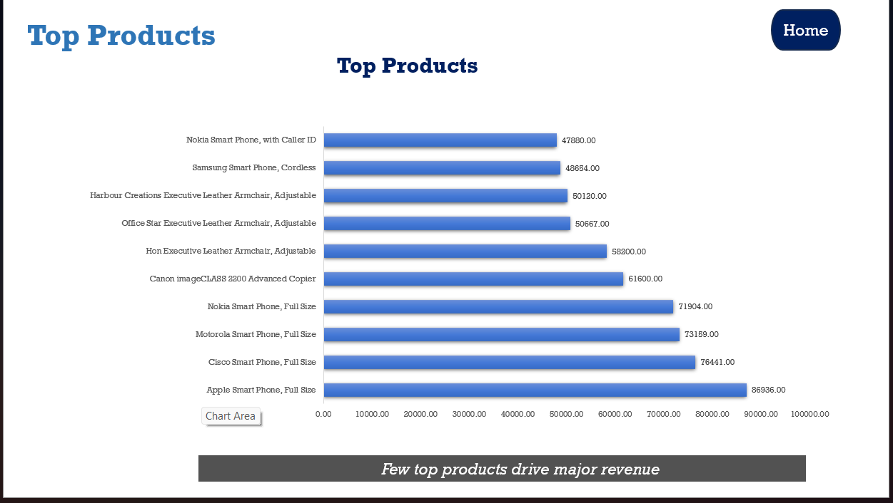
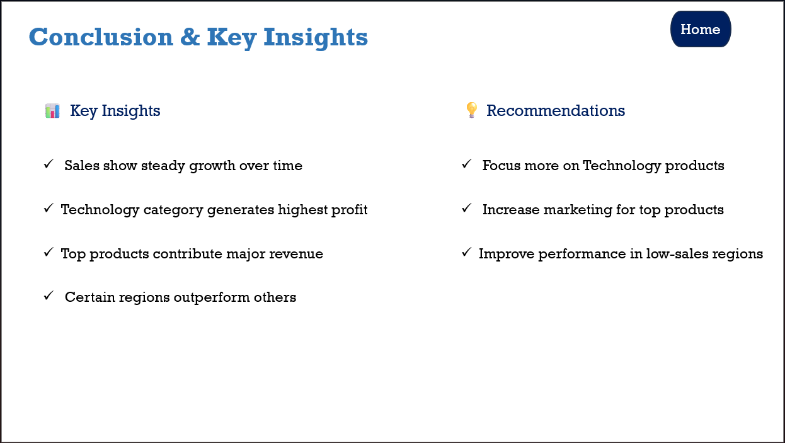

# Ecommerce-Sales-Dashboard-PowerPoint
Interactive PowerPoint dashboard analyzing e-commerce sales data with insights on sales trends, profit, regions, and top products.
#  E-commerce Sales Dashboard (PowerPoint Project)

##  Project Overview
This project is an interactive PowerPoint dashboard created to analyze and present e-commerce sales data in a visually engaging way. It focuses on transforming raw data into meaningful insights using charts, navigation, and storytelling.

##  Features
- Interactive navigation buttons (Home, Sales, Profit, Region, Top Products)
- Animated transitions for better visualization
- Data-driven storytelling
- Clean and structured dashboard layout

##  Dashboard Sections

###  Sales Analysis
- Shows sales trends over time
- Identifies growth patterns

###  Profit Analysis
- Compares profit across categories
- Highlights highest-performing category

###  Region Analysis
- Displays sales distribution by region
- Helps identify strong and weak markets

###  Top Products
- Lists products generating highest revenue
- Helps understand key contributors to business success

##  Key Insights
- Sales show consistent growth over time
- Technology category generates the highest profit
- A small number of products contribute to major revenue
- Certain regions outperform others

##  Recommendations
- Focus more on high-profit categories (Technology)
- Increase marketing for top-performing products
- Improve strategies in low-performing regions

##  Tools Used
- Microsoft PowerPoint

##  Project Files
- PowerPoint file (.pptx)
- Project screenshots

##  How to Use
1. Download the PPT file
2. Open in Microsoft PowerPoint
3. Use navigation buttons to explore different sections

##  Preview

###  Dashboard Home

###  Sales Analysis

###  Profit Analysis

###  Region Analysis

###  Top Products

###  Conclusion & Insights

##  Author
Chandini Patan 
